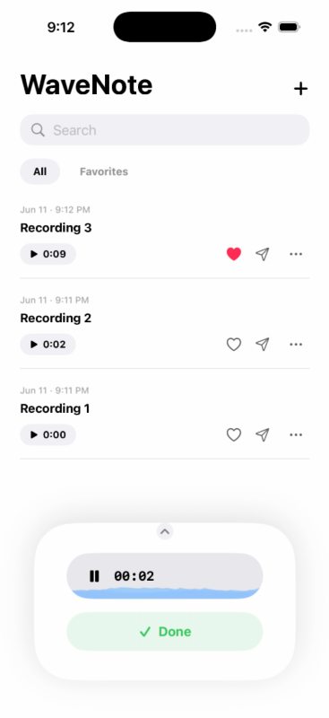

# WaveNote 🎙️

A iOS audio recorder built entirely in **Swift** and **SwiftUI**. Record voice memos with real-time waveform visualisation, manage your library, and play back any recording — all from a single, elegant screen.

## 📱 Demo

[](assets/demo.mov)

> 📹 Click the thumbnail above to watch the full app demo (recorded on iPhone 17 Pro Simulator).

---

## ✨ Features

### 🎤 Recording
- Tap the centered floating **mic button** to start recording instantly.
- Audio is captured in **AAC / .m4a** format at **44,100 Hz** with high-quality encoding via `AVAudioRecorder`.
- Live **metering at 30 fps** feeds three distinct waveform visualisations in real-time.
- **Pause & resume** recording without losing progress.
- Tap the green **"Done"** button to stop and save. A bounce-animated checkmark confirms the save.

### 📊 Real-Time Waveform Visualisations
Three custom waveform components, all drawn with **SwiftUI `Canvas`** and `Path`:

| Component | Description |
|---|---|
| **`WaveformView`** | A 60-bar rolling waveform with opacity gradient — used during both recording and playback. |
| **`CircularWaveformView`** | A concentric, multi-layered pulsing glow ring that reacts to audio levels — displayed in the expanded player sheet. |
| **`FluidWaveformView`** | An organic, multi-wave fluid animation with parallax layers — used in the compact sheet and the splash screen. |

All three are driven by a `Timer`-based metering loop updating at **30 fps** and read `averagePower(forChannel:)` dB values mapped to a normalised `0…1` range.

### 📂 Recordings List
- Displays each recording's **title**, **duration**, and **date/time**.
- Inline actions per row:
  - ▶️ **Play / Pause** capsule button
  - ❤️ **Favourite** toggle with spring bounce animation
  - ✈️ **Share** via native `ShareLink`
  - ⋯ **Context menu** → Rename · Delete
- Filter tabs: **All** and **Favourites**.
- Integrated **search bar** for instant title filtering.

### 🔊 Audio Playback
- Tapping a recording opens a unified **slide-up bottom sheet** (compact or expanded).
- Controls include:
  - **Play / Pause** toggle
  - **Skip ±10 seconds** (forward / backward)
  - **Slider scrubber** with elapsed & total time labels
  - Real-time **circular waveform** + **rolling bar waveform** during playback
- Playback powered by `AVAudioPlayer` with metering enabled.

### 🎨 Design & UX
- **Animated splash screen** with a waveform icon (`symbolEffect`), fade-in text, and a fluid wave footer.
- **Haptic feedback** on every interactive element (record, play, pause, favourite, delete, tab switch) using `UIImpactFeedbackGenerator` and `UINotificationFeedbackGenerator`.
- Clean **black-and-white minimalist** aesthetic with blue waveform accent highlights.
- Smooth **spring animations** on sheet expand/collapse, save confirmation, and heart toggle.

---

## 🏗️ Architecture

The project follows the **MVVM** pattern with a clear separation between data, services, view models, and views:

```
WaveNote/
├── WaveNoteApp.swift                           — App entry point
│
├── Models/
│   └── Recording.swift                         — Codable data model (id, title, url, date, duration, isFavorited)
│
├── Services/
│   ├── AudioRecorderService.swift              — AVAudioRecorder wrapper + 30 fps metering timer
│   ├── AudioPlayerService.swift                — AVAudioPlayer wrapper + progress/metering timer
│   ├── FileStorageService.swift                — JSON metadata persistence + audio file management
│   ├── HapticFeedback.swift                    — Centralised haptic feedback helpers
│   └── AppLogger.swift                         — Lightweight tagged logger
│
├── ViewModels/
│   ├── RecorderViewModel.swift                 — Recording flow, permission handling, waveform buffer, list CRUD
│   └── PlayerViewModel.swift                   — Playback state bridge between service and views
│
└── Views/
    ├── Main/
    │   ├── ContentView.swift                   — Splash → Home transition controller
    │   ├── SplashView.swift                    — Animated launch screen
    │   └── HomeView.swift                      — Main screen: header, search, tabs, list, bottom sheet
    ├── Components/
    │   └── RecordingRowView.swift              — Recording list row with inline controls
    └── Waveform/
        ├── WaveformView.swift                  — Rolling bar waveform (Canvas)
        ├── CircularWaveformView.swift          — Pulsing glow ring visualiser (TimelineView)
        └── FluidWaveformView.swift             — Organic multi-layer wave (Canvas + TimelineView)
```

### Key Design Decisions

- **Single-screen UI** — the entire experience lives in `HomeView` with a dynamic bottom sheet that morphs between compact, expanded, recording, and playback states.
- **No third-party dependencies** — the project uses only Apple frameworks (`AVFoundation`, `SwiftUI`, `UIKit` for haptics).
- **30 fps metering** strikes the best balance between smooth animation and battery efficiency.

---

## 📋 Requirements

| Requirement | Version |
|---|---|
| **Xcode** | 16.0+ |
| **iOS Deployment Target** | 18.0+ |
| **Swift** | 5.9+ |
| **Device** | Physical iPhone recommended (microphone access) |

> **Note:** Audio recording works on a physical device. The iOS Simulator can use the host Mac's microphone if enabled.

---

## 🚀 Setup Instructions

1. **Clone the repository**
   ```bash
   git clone https://github.com/kartkik/WaveNote.git
   cd WaveNote
   ```

2. **Open in Xcode**
   ```bash
   open WaveNote.xcodeproj
   ```

3. **Configure signing**
   - Navigate to the **WaveNote** target → **Signing & Capabilities**.
   - Select your **Team** (Personal Team works for device testing).

4. **Build & Run**
   - Select a physical device or simulator.
   - Press `⌘R` to build and run.

5. **Grant microphone permission** when prompted on first launch.

---


---

## ✅ Bonus Features Implemented

- [x] **Rename recordings** — inline context menu → alert with text field
- [x] **Delete recordings** — context menu with destructive action + file cleanup
- [x] **Favourite recordings** — heart toggle with spring bounce animation + dedicated filter tab
- [x] **Share recordings** — native SwiftUI `ShareLink` for each row
- [x] **Background audio recording** — `UIBackgroundModes: audio` enabled in `Info.plist`
- [x] **Haptic feedback** — contextual haptics on every interactive element
- [x] **Animated splash screen** — logo spring, text fade, fluid waveform footer
- [x] **Pause & resume recording** — without losing the current session
- [x] **Search** — instant title filtering across all recordings

---
